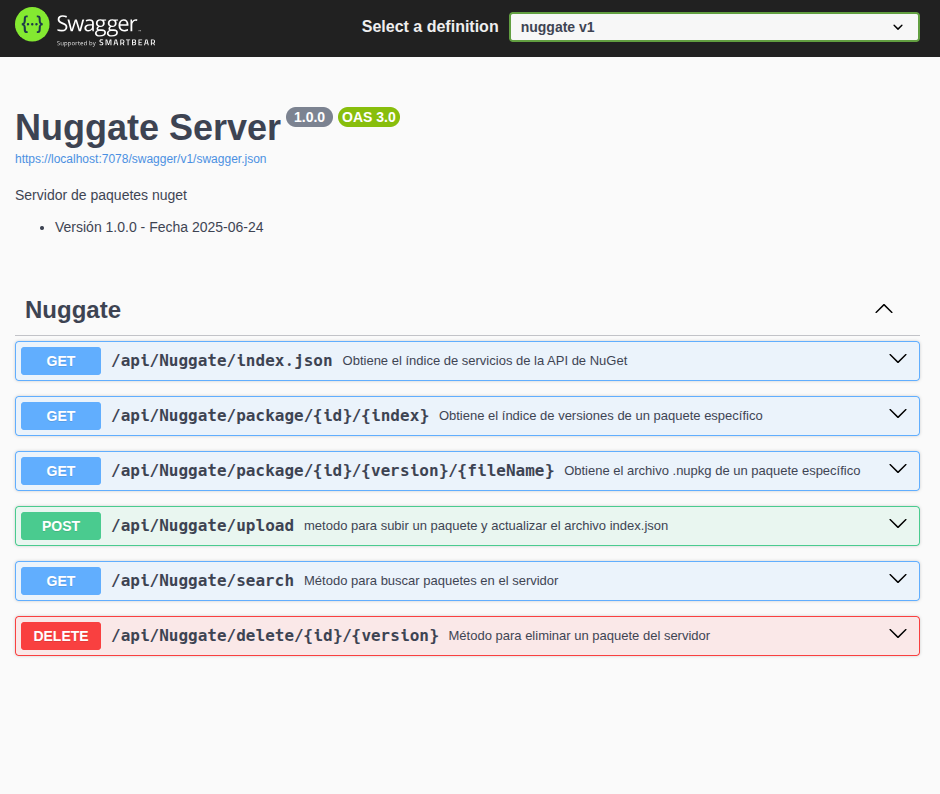

<h1>Nuggate</h1>

<p><b>Tu servidor privado de paquetes NuGet — simple, seguro y autoalojado</b><br/></p>

<p>
    
    
    
    
    
</p>

---

## 🧩 ¿Qué es Nuggate?

**Nuggate** es un servidor **ligero y autoalojado** para hospedar tus propios paquetes **NuGet privados**.
Ideal para equipos y empresas que necesitan mantener bibliotecas internas sin depender de servidores públicos o GitHub Packages.

💡 Diseñado para ser desplegado en minutos — sin configuraciones complicadas ni infraestructura externa.

---

## 🚀 Características

- 🪶 **Ligero** — Web API .NET 9 sin dependencias innecesarias  
- 🔒 **Privado y seguro** — control total del acceso a tus paquetes  
- ⚙️ **Autoalojado** — en tu servidor con pubicación de api o en un contenedor Docker  
- 🧱 **Simple de configurar** — archivos planos en almacenamiento local del servidor

---

## ⚙️ Instalación 

### Clona el repositorio
```bash
    git clone https://github.com/sepulvedamarcos/nuggate.git
    cd nuggate
```

### 🐳 Opción 1 rápida: Docker
Descarga la imagen que esta publicada en este repositorio luego ejecuta el contenedor con el siguiente comando:

```bash
docker run -d \
  -p 8080:80 \
  -v /ruta/a/paquetes:/app/packages \
  -e NUGGATE_APIKEY="mi_clave_secreta" \
  --name nuggate \
  sepulvedamarcos/nuggate:latest
```


### Opción 2: Crea la imagen y el contenedor Docker
Clona el proyecto y crea la imagen docker con el siguiente comando:

```bash
docker build -t sepulvedamarcos/nuggate:latest .
```

ahora usa el comando anterior para ejecutar el contenedor.


### 🖥️ Opción 2: Manual (.NET 9 SDK requerido)
1. Clona este repositorio y ejecuta los siguientes comandos:
```bash
    dotnet restore
    dotner publish --configuration Release --output ./publish
```
empaqueta la aplicación en la carpeta `publish` y publica en tu servidor.

## 🖼️ Captura swagger autodocumentado

Aquí puedes ver una imagen del swagger desplegado con los endpoint/metodos/Verbos a usar.



## ⚖️ Licencia

Este proyecto está licenciado bajo la GPL-V3.0 License.
Consulta el archivo LICENSE para más información.


## ¿Te resultó útil Nuggate?
<p align="center"><p align="center">

[](https://github.com/sepulvedamarcos/nuggate/stargazers)

  <a href="https://ko-fi.com/sepulvedamarcos">
    
  </a>
</p>